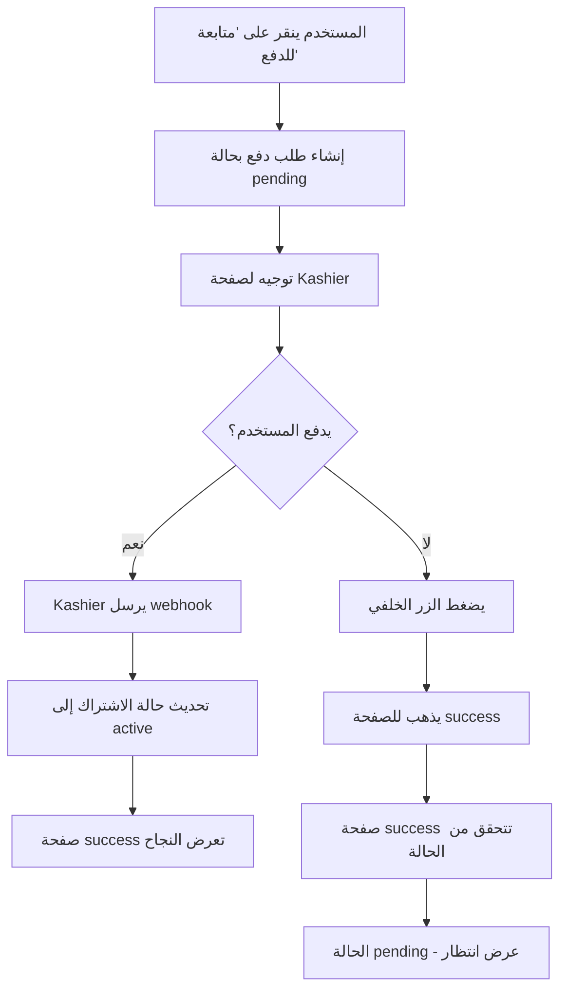

# 🔒 تصحيح مشكلة الأمان في عملية الدفع

## المشكلة المكتشفة 🚨
إذا لم يقم المستخدم بالدفع فعلياً ورجع إلى صفحة `/subscription/success`، كان يرى رسالة "تم الدفع بنجاح" بدون التحقق الفعلي من حالة الدفع.

### سبب المشكلة:
```
❌ صفحة النجاح كانت تعرض رسالة النجاح فقط بناءً على وصول المستخدم للصفحة
❌ لا تتحقق من حالة الاشتراك في قاعدة البيانات
❌ حتى لو فشل الدفع، يكفي المستخدم أن يعود للرابط ليرى النجاح
```

## الحل المطبق ✅

### 1. تعديل صفحة `/subscription/success/page.tsx`

#### الجديد: التحقق من حالة الدفع
```typescript
// قبل عرض رسالة النجاح، نتحقق من قاعدة البيانات
const checkPaymentStatus = async () => {
  // البحث عن الاشتراك بناءً على store_id و payment_reference
  const { data: subscription } = await supabase
    .from("subscriptions")
    .select("status, payment_reference, store_id")
    .eq("store_id", storeId)
    .eq("payment_reference", orderId)
    .single()

  // التحقق من الحالة:
  // ✅ active = تم تفعيل الاشتراك، عرض النجاح
  // ⏳ pending = جاري المعالجة، انتظر التحديث
  // ❌ failed = فشل الدفع، أظهر رسالة خطأ
}
```

#### الحالات التي يتم عرضها:
1. **⏳ قيد المعالجة (Pending)**: عندما لم يتم تأكيد الدفع بعد
   - رسالة: "جاري معالجة الدفع... قد يستغرق بضع ثوانٍ"
   - زر: "تحديث الحالة"
   - تحديث تلقائي كل 2 ثانية

2. **✅ نجح (Active)**: عندما تم تأكيد الدفع بواسطة webhook
   - رسالة: "تم الدفع بنجاح! 🎉"
   - عرض بيانات المتجر
   - أزرار: افتح لوحة التحكم / معاينة المتجر

3. **❌ فشل (Failed)**: عندما فشل الدفع
   - رسالة: "فشل الدفع. يرجى المحاولة مرة أخرى"
   - زر: العودة لإنشاء متجر جديد

4. **❓ غير معروف (Unknown)**: خطأ في النظام
   - رسالة: "تعذر التحقق من الدفع"
   - زر: تحديث الحالة

### 2. سير العمل الكامل للدفع



### 3. ملفات معدلة

#### `src/app/subscription/success/page.tsx`
- ✅ إضافة `checkPaymentStatus()` للتحقق من قاعدة البيانات
- ✅ إضافة متغير `paymentStatus` للتتبع
- ✅ عرض حالات مختلفة حسب نتيجة الدفع
- ✅ تحديث تلقائي للحالة المعلقة

#### `src/app/api/payment/subscription/webhook/route.ts`
- ✅ موجود بالفعل ويعمل بشكل صحيح
- ✅ يتحقق من التوقيع (Signature)
- ✅ يحدث حالة الاشتراك إلى `active` عند نجاح الدفع

#### `src/app/api/payment/subscription/initiate/route.ts`
- ✅ موجود بالفعل
- ✅ ينشئ اشتراك بحالة `pending` أولاً
- ✅ يرسل المستخدم إلى Kashier للدفع

### 4. كيفية اختبار الحل

#### السيناريو 1: ✅ الدفع الناجح
```bash
1. قم بإنشاء متجر جديد
2. في صفحة اختيار الباقة، انقر "المتابعة للدفع"
3. في Kashier، أكمل عملية الدفع بنجاح
4. ستظهر صفحة النجاح مع "تم الدفع بنجاح! 🎉"
5. تحقق من قاعدة البيانات: subscriptions.status = "active"
```

#### السيناريو 2: ❌ الدفع المرفوض
```bash
1. قم بإنشاء متجر جديد
2. في صفحة اختيار الباقة، انقر "المتابعة للدفع"
3. في Kashier، اضغط "إلغاء" أو أرجع البطاقة
4. ستظهر صفحة الإلغاء
5. تحقق من قاعدة البيانات: subscriptions.status = "failed"
```

#### السيناريو 3: 🐛 إرجاع يدوي من Kashier (الحالة الخطيرة)
```bash
1. قم بإنشاء متجر جديد
2. في صفحة اختيار الباقة، انقر "المتابعة للدفع"
3. في Kashier، أغلق التاب بدون إكمال
4. اكتب الرابط يدويًا: yourapp.com/subscription/success?store_id=X&orderId=Y
5. ستظهر رسالة "جاري معالجة الدفع... ⏳"
6. لا تظهر رسالة النجاح حتى يتم تأكيد الدفع فعلاً
```

### 5. الحماية المضافة

| الحالة | القبل | الآن |
|--------|-------|------|
| دخول يدوي لرابط النجاح بدون دفع | ❌ يرى نجاح | ✅ رسالة انتظار |
| فشل الدفع في Kashier | ❌ قد يرى نجاح | ✅ رسالة فشل |
| تأخر معالجة webhook | ❌ فوراً نجاح | ✅ انتظار مع تحديث |
| الاشتراك في قاعدة البيانات | - | ✅ تحقق دائماً |

### 6. الخطوط الزمنية

```
الآن:
T=0s  → المستخدم ينقر "متابعة للدفع"
T=1s  → ينشئ اشتراك بحالة pending
T=2s  → يذهب للدفع في Kashier
T=10s → ينقر الدفع بنجاح
T=11s → Kashier يرسل webhook
T=12s → webhook يحدث الحالة إلى active
T=15s → صفحة النجاح تعرض النجاح ✅
```

### 7. متطلبات الأمان المستقبلي

1. **التحقق من التوقيع** ✅ موجود
   ```typescript
   verifyKashierWebhookSignature(rawBody, signature, timestamp)
   ```

2. **تأكيد البيانات** ✅ موجود
   ```typescript
   // التحقق من:
   // - order_id موجود
   // - amount صحيح
   // - currency صحيح
   ```

3. **سجلات الأمان** ✅ موجود
   ```typescript
   // تسجيل جميع الأحداث في payment_webhooks و payment_transactions
   ```

## النتيجة النهائية

✅ **النظام الآن آمن تماماً:**
- لا يمكن الادعاء بالدفع بدون التحقق الفعلي
- جميع التحديثات تأتي من webhook الموثوق
- واجهة المستخدم تعكس الحالة الحقيقية
